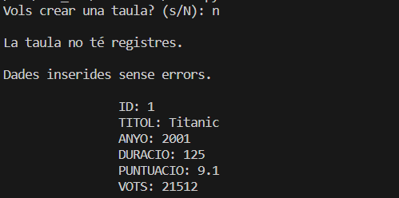
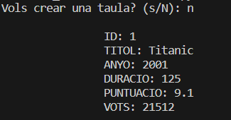
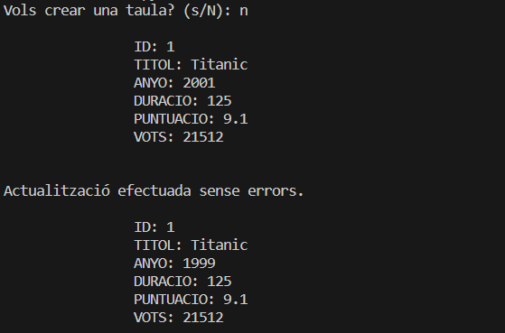
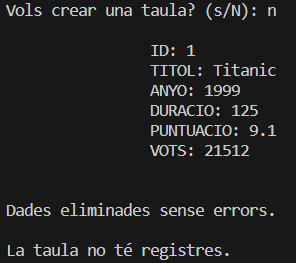

# M10_UF2

## Practica 2

Si la taula no té registres, al executar el read mostra el missatge "La taula no té registres."

### Part Create

### Part Read

### Part Update

### Part Delete

* [ ] 
